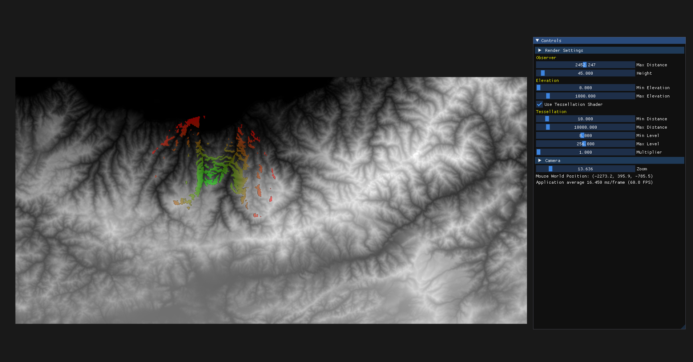

# Line Of Sight Analyzer
This line sight of analyzer is implemented without using ray casting techniques. It works at realtime on my computer.

The idea is that rendering the scene where observer stands with different angles and 
writing the fragment's world position and colors to two different textures attached to a custom framebuffer.
Then using this textures (I called them position and color texture) and using the default framebuffer
I render the scene from another angle using these two textures and I color the fragments if those have the same world position as observer's render pass. 

The result seems okay but I am not sure if the idea is correct.

## Screenshots

## Build
Simply open `LineOfSightAnalyzer.pro` with `Qt Creator` and build it with kit `Qt 6.2.5 MSVC2019 64bit` and run. Other compilers should also work.
